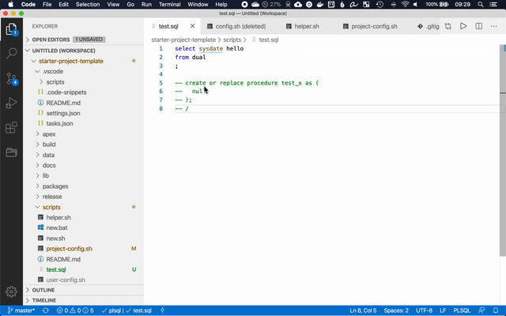

# Integração com Visual Studio Code

> Compile PL/SQL, exporte APEX e gere novos objetos sem sair do editor.

---

## Início Rápido

```bash
# 1. Abra o projeto no VSCode
code /caminho/para/template_apex

# 2. Na primeira execução, será gerado scripts/user-config.sh
#    Configure com seus dados de conexão

# 3. Use Ctrl+Shift+B para acessar as tarefas
```

> **Windows:** Configure WSL ou cmder como terminal bash no VSCode.
> Veja [instruções](../README.md#configuração-windows).

---

## Tarefas Disponíveis

Acesse com `Ctrl+Shift+B` (Windows/Linux) ou `Cmd+Shift+B` (macOS):

| Tarefa | Comando | O que faz |
|:--|:--|:--|
| **Compilar** | `compilar: <projeto>` | Compila o arquivo PL/SQL aberto no editor |
| **Exportar APEX** | `exportar apex: <projeto>` | Exporta todas as aplicações APEX configuradas |
| **Gerar Objeto** | `gerar objeto: <projeto>` | Cria novo package, view ou script de dados |

> Os nomes das tarefas são atualizados automaticamente com o nome da pasta do projeto na primeira execução.

---

## Exemplos de Uso

### Compilar um Package

1. Abra o arquivo `packages/pkg_clientes.pkb`
2. Pressione `Ctrl+Shift+B`
3. Selecione `compilar: template_apex`
4. O arquivo será compilado no banco via SQLcl/SQL*Plus



### Exportar Aplicação APEX

1. Pressione `Ctrl+Shift+B`
2. Selecione `exportar apex: template_apex`
3. As aplicações definidas em `project-config.sh` serão exportadas para `apex/`

```bash
# Resultado esperado:
apex/f100.sql    # Aplicação 100 exportada
apex/f200.sql    # Aplicação 200 exportada
```

### Gerar um Novo Objeto

1. Pressione `Ctrl+Shift+B`
2. Selecione `gerar objeto: template_apex`
3. Escolha o tipo: `package`, `view`, `data_array` ou `data_json`
4. Digite o nome do objeto (ex: `pkg_pedidos`)

```bash
# Resultado para "package" + "pkg_pedidos":
packages/pkg_pedidos.pks    # Spec gerada a partir do template
packages/pkg_pedidos.pkb    # Body gerada a partir do template
# Todas as ocorrências de CHANGEME foram substituídas por pkg_pedidos
```

---

## Configuração

### `tasks.json`

Define as tarefas do VSCode. Os rótulos `CHANGEME_TASKLABEL` são substituídos automaticamente pelo nome da pasta do projeto na primeira execução de qualquer script bash.

### Arquivos de Script

| Arquivo | Função |
|:--|:--|
| `scripts/run_sql.sh` | Compilação de arquivos SQL/PL-SQL |
| `scripts/apex_export.sh` | Exportação de aplicações APEX |
| `scripts/gen_object.sh` | Geração de novos objetos |

---

<details>
<summary><strong>Dica: Atalhos para navegar entre editor e terminal</strong></summary>

<br>

Configure em `Preferências > Atalhos de Teclado`:

| Ação | Atalho sugerido |
|:--|:--|
| Focalizar editor | `Ctrl+1` / `Cmd+1` |
| Focalizar terminal | `Ctrl+2` / `Cmd+2` |

Isso permite alternar rapidamente para copiar SQL do editor e colar no terminal (em uma sessão SQLcl).

</details>

---

<sub>Mantido por <a href="https://github.com/maxwbh">@maxwbh</a> — Maxwell da Silva Oliveira — M&S do Brasil LTDA</sub>
