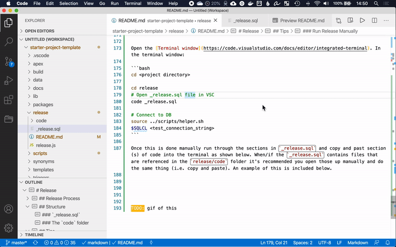

# Release

- [Estrutura](#estrutura)
  - [`_release.sql`](#_releasesql)
  - [Arquivos `all_....sql`](#arquivos-all_sql)
  - [A pasta `code`](#a-pasta-code)
- [Processo de Release](#processo-de-release)
  - [Conceito 1: Código é marcado (tag) cada vez que é executado em Produção](#conceito-1-código-é-marcado-tag-cada-vez-que-é-executado-em-produção)
  - [Conceito 2: Código é marcado (tag) cada vez que sai de Dev](#conceito-2-código-é-marcado-tag-cada-vez-que-sai-de-dev)
  - [Executando um Release em Produção](#executando-um-release-em-produção)
- [Dicas](#dicas)
  - [Executar Release Manualmente](#executar-release-manualmente)

Esta pasta contém exemplos de como estruturar releases junto com várias opções de **como** realizar um release. Antes de prosseguir, você deve ter um [fluxo de trabalho Git](../README.md#fluxos-de-trabalho-git) definido, pois alguns dos exemplos de `git` podem precisar ser adaptados ao fluxo de trabalho escolhido.

## Estrutura

Alguns arquivos são fornecidos por padrão para ajudar a guiar seu processo de release.


### `_release.sql`

Script de release de exemplo. Este é o único arquivo que será executado para cada release. Dentro de `_release.sql`, ele referencia outros arquivos necessários para o release. Ao ter um único arquivo consistente para cada release, isso ajuda a simplificar os scripts de release ao usar ferramentas de automação.

Você deve revisar este arquivo e modificá-lo conforme as necessidades do seu projeto. Novamente, cada projeto é diferente e é esperado que este arquivo seja modificado para atender às necessidades do seu projeto.

### Arquivos `all_....sql`

Existem vários arquivos `all*.sql` descritos abaixo. Todos os arquivos marcados como gerados automaticamente são gerados durante o processo de [build](../build).

Arquivo | Gerado Automaticamente | Descrição
--- | --- | ---
[`all_apex.sql`](all_apex.sql) | Sim | Instalará todas as aplicações APEX conforme definido em [`scripts/project-config.sh`](../scripts/project-config.sh)
[`all_data.sql`](all_data.sql) | Não | Executa todos os scripts de dados re-executáveis. Você deve adicionar referências manualmente a este arquivo, pois a ordem importa
[`all_packages.sql`](all_packages.sql) | Sim | Referencia todos os packages na pasta `packages`. Por padrão, executará primeiro todos os arquivos `.pks` e depois os arquivos `.pkb`
[`all_views.sql`](all_views.sql) | Sim | Referencia todas as views na pasta `views`
[`load_env_vars.sql`](load_env_vars.sql) | Sim | Carrega algumas variáveis de ambiente, definidas em [`scripts/project-config.sh`](../scripts/project-config.sh), na sessão SQL


### A pasta `code`

Esta pasta armazena código não re-executável específico de cada release. É recomendado criar um arquivo por ticket. Ex: `code/issue-123.sql`. O conteúdo de `code/issue-123.sql` pode conter coisas como instruções DDL e DML. Código re-executável (como views, packages, etc.) **não deve** estar aqui. Em vez disso, armazene-os nas pastas apropriadas incluídas neste projeto. Após cada release, o conteúdo da pasta `code` será excluído, pois não é mais necessário.

Cada arquivo criado na pasta `code` deve ser adicionado a `code/_run_release_code.sql`. Este arquivo deve ser limpo após cada release. Exemplos de como `code/_run_release_code.sql` ficaria:

```sql
@issue-123.sql
@issue-456.sql
```


## Processo de Release

Releases Oracle são muito "implacáveis" (ou seja, se um erro ocorrer, pode arruinar todo o restante do release e dificultar a reversão). Isso pode tornar muito difícil executar ferramentas padrão de CI/CD para releases Oracle, pois um erro pode corromper completamente um ambiente e pode não ser fácil "restaurar" o schema para um ponto no tempo anterior ao release. *Nota: Tornar scripts de release re-executáveis ou fornecer suporte a rollback não é impossível, porém pode ser muito custoso fazê-lo adequadamente.*

O restante desta seção assume o seguinte:
- O processo de release não é re-executável. Por exemplo, se uma instrução DDL falhar, não há como saber se ela já foi executada.
- Não há script de rollback para desfazer todas as alterações de um determinado release
- O código vai de `Dev > Teste > Prod`
- O código pode ser executado manualmente no ambiente de Teste

As seções abaixo cobrem dois tipos de estratégias para realizar releases. Nenhuma é "melhor" que a outra; elas apenas cobrem diferentes situações de equipe e cultura. As seguintes premissas são feitas para o seu processo de desenvolvimento:

- Sprints de desenvolvimento "curtos" de ~2 semanas
- A equipe de desenvolvimento trabalha em um bloco de código, libera para Teste, e então vai para Produção rapidamente
- O desenvolvimento ativo ocorre na branch `master`


Exemplos abaixo mostram o processo para desenvolver o release `1.0.0` da aplicação. As seguintes variáveis foram definidas para ajudar a tornar estes scripts re-executáveis:

```bash
RELEASE_VERSION=1.0.0
GIT_PRE_RELEASE_BRANCH=pre-release-$RELEASE_VERSION
```

*Nota: o [versionamento semântico](https://semver.org/lang/pt-BR/) é recomendado para números de versão. Resumindo: numeração `major.minor.patch`.*

### Conceito 1: Código é marcado (tag) cada vez que é executado em Produção

Neste processo, o código é marcado cada vez que **vai para Produção**. Isso significa que toda vez que uma correção é aplicada em Teste, o script de release deve ser atualizado manualmente. Isso apresenta um risco de que a ordem das correções aplicadas importa. O aspecto positivo é que pode tornar os releases mais simples, mas requer mais diligência manual. O exemplo a seguir mostra o processo.

- Uma vez que o sprint inicial está completo, o código é marcado em uma branch de "pré-release":

```bash
git checkout -b $GIT_PRE_RELEASE_BRANCH master
git push --set-upstream origin
```

- [Execute o release manualmente](#executar-release-manualmente) no ambiente de Teste

Se um bug for encontrado em Teste e precisar ser corrigido, o seguinte ocorrerá (assumindo que um DDL e uma view precisam mudar):

```bash
git checkout $GIT_PRE_RELEASE_BRANCH
# edite release/code/issue-123.sql com a nova instrução DDL
# edite views/minha_view.sql

# Conecte ao ambiente de TESTE e execute manualmente a instrução DDL
# sqlcl <string_de_conexao>
#
# alter table minha_tabela add (nova_coluna varchar2);
#
# @views/minha_view.sql
# exit


# Commitar alterações
git add *
git commit -m "correção de patch"
git push

# Mesclar alterações de volta ao master
git checkout master
git merge $GIT_PRE_RELEASE_BRANCH
```

**Nota importante:** É crítico que ao modificar um arquivo com DDL, o DDL seja colocado na ordem correta em que *deveria* ter sido executado.

Este ciclo de correção pode acontecer várias vezes. Uma vez que é **100% certificado**, marque o release:

```bash
git checkout $GIT_PRE_RELEASE_BRANCH
git tag $RELEASE_VERSION
git push origin --tags

# Remover a branch de pré-release
git checkout master
git push --delete origin $GIT_PRE_RELEASE_BRANCH
git branch -d $GIT_PRE_RELEASE_BRANCH

# Limpar a pasta de release
# Onde <nome_pasta_base> é a pasta raiz deste projeto
# Por exemplo, se a pasta base do projeto está em /users/maxwell/git/template_apex, a chamada seria: reset_release template_apex
source scripts/helper.sh
reset_release <nome_pasta_base>
```

Para executar o release em produção, veja [Executando em Produção](#executando-um-release-em-produção) abaixo.


### Conceito 2: Código é marcado (tag) cada vez que sai de Dev

Este método é semelhante ao Conceito 1, exceto que marca o código cada vez que ele **sai de Dev** (em vez de ir para produção).

O aspecto positivo desta abordagem é que reduz o risco de releases não executarem corretamente em produção. No primeiro conceito, quando uma correção é aplicada, ela é aplicada manualmente e o script de release é alterado. Existe a possibilidade de que quem estiver aplicando a correção erre a ordem, de modo que ao ir para produção, possa quebrar.

O aspecto *negativo* desta abordagem é que muitos releases são criados. Por exemplo, suponha que a versão `1.0.0` é criada, mas alguns bugs são encontrados durante a fase de teste. As versões `1.0.1`, `1.0.2` e `1.0.3` também podem ser criadas para cada correção. Ao ir para produção, todos os quatro releases devem ser implantados. À primeira vista, isso parece muito trabalho, mas não é muita sobrecarga.

O exemplo a seguir mostra como este conceito é feito no git:

- Uma vez que o código inicial está pronto para ser implantado em Teste, corrija quaisquer problemas, mescle as alterações de volta, e marque o release.

```bash
git checkout -b $GIT_PRE_RELEASE_BRANCH master
git push --set-upstream origin
```

- [Execute o release manualmente](#executar-release-manualmente) no ambiente de Teste
- Mescle as alterações de volta ao `master` (caso alguma alteração tenha sido feita), marque o código, e limpe o release.

```bash
# Certifique-se de que todas as alterações feitas/corrigidas durante o release (na GIT_PRE_RELEASE_BRANCH) foram commitadas
# Mesclando alterações de volta ao master
git checkout master
# Obter as últimas alterações de código.
git pull origin master
git merge $GIT_PRE_REL_BRANCH
git push origin master


# Marcar release
git checkout $GIT_PRE_REL_BRANCH
git tag $RELEASE_VERSION
git push origin --tags

# Remover branch de pré-release (ou seja, limpeza)
git checkout master
git push --delete origin $GIT_PRE_REL_BRANCH
git branch -d $GIT_PRE_REL_BRANCH

# Limpar a pasta de release
# Onde <nome_pasta_base> é a pasta raiz deste projeto
# Por exemplo, se a pasta base do projeto está em /users/maxwell/git/template_apex, a chamada seria: reset_release template_apex
source scripts/helper.sh
reset_release <nome_pasta_base>
```

Cada vez que o código precisa ir para o ambiente de Teste, use os mesmos scripts acima. Ou seja, crie outro release e execute em Teste.


Uma vez que tudo estiver pronto para produção, a seção [Executando em Produção](#executando-um-release-em-produção) ainda se aplica. Em vez de executar apenas um release, pode ser necessário executar múltiplos releases para atualizar produção. No nosso exemplo no início desta seção, `1.0.0`, `1.0.1`, `1.0.2` e `1.0.3` todos precisariam ser executados.


### Executando um Release em Produção

Para executar um release em Produção automaticamente:

```bash
# Assumindo que você está na pasta raiz
# Carregar helper (necessário apenas para definir a variável $SQLCL. Sempre é possível codificar diretamente o executável SQLcl)
source scripts/helper.sh
# Obter tag
git checkout tags/<ALTERE_NOME_DA_TAG>
cd release
# O release inclui "exit" como última linha
$SQLCL <string_conexao_prod> @_release.sql
# O release não inclui "exit" como última linha (o _release.sql padrão contém uma instrução exit)
# echo exit | $SQLCL <string_conexao_prod> @_release.sql

# Mostrar se ocorreram erros (opcional)
# Adicione lógica adicional aplicável para lidar com releases bem-sucedidos e inválidos
if [ $? -eq 0 ] ; then
  echo "Release bem-sucedido"
else
  echo "Release: **ERROS** "
fi
```


## Dicas

### Executar Release Manualmente

Executar o release manualmente pode ajudar a detectar erros rapidamente e corrigi-los imediatamente. Ao usar as ferramentas e técnicas certas, isso pode ser feito muito rapidamente.

Premissas:
- Usando [Visual Studio Code](https://code.visualstudio.com/) (VSC) (ou editor de texto similar)
  - Terminal configurado para `bash` (TODO: Link para documentação do cmder para usuários Windows)
  - Atalhos configurados para navegar rapidamente entre o arquivo atual e o terminal. No VSC `Preferências > Atalhos de Teclado`: (*Usuários Windows: substituam `cmd` por `ctrl`*)
    - Configure: `Exibir: Focalizar Primeiro Grupo de Editores` para `cmd+1`
    - Configure: `Terminal: Focalizar Terminal` para `cmd+2`
    - Agora você pode alternar entre o editor e a janela do terminal usando `Cmd+1` e `Cmd+2`. Isso é fundamental para percorrer arquivos grandes, copiar do editor e colar no terminal (em uma sessão SQLcl)


Abra a [janela do Terminal](https://code.visualstudio.com/docs/editor/integrated-terminal) (`Terminal > Novo Terminal`) e execute:

```bash
cd <diretório_do_projeto>

cd release
# Abrir o arquivo _release.sql no VSC
code _release.sql

# Conectar ao banco de dados
source ../scripts/helper.sh
$SQLCL <string_conexao_teste>
```

Uma vez feito isso, percorra manualmente as seções em `_release.sql` e copie e cole cada seção de código no terminal conforme mostrado abaixo. Quando o `_release.sql` contiver arquivos referenciados na pasta `release/code`, é recomendado abri-los manualmente e fazer o mesmo (ou seja, copiar e colar).



---

> **Mantido por:** [@maxwbh](https://github.com/maxwbh) — Maxwell da Silva Oliveira — M&S do Brasil LTDA
